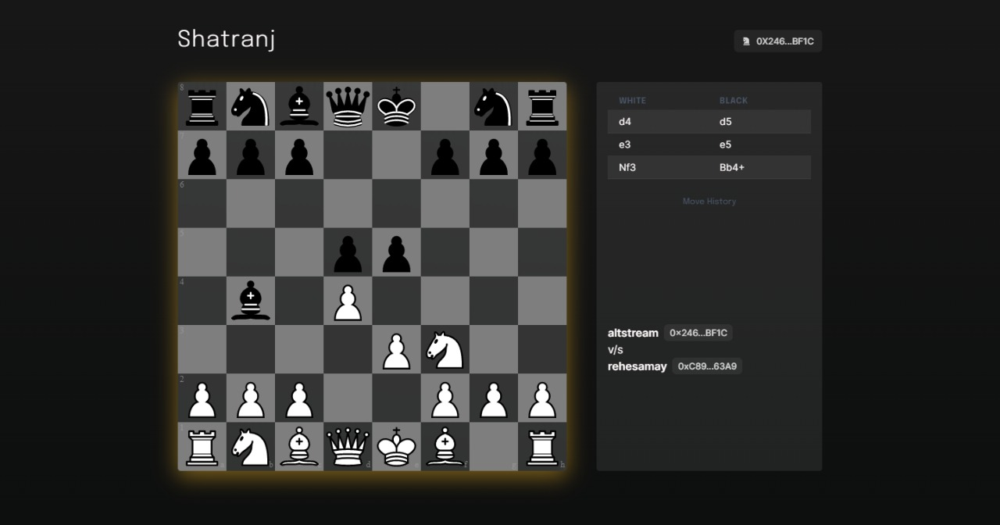
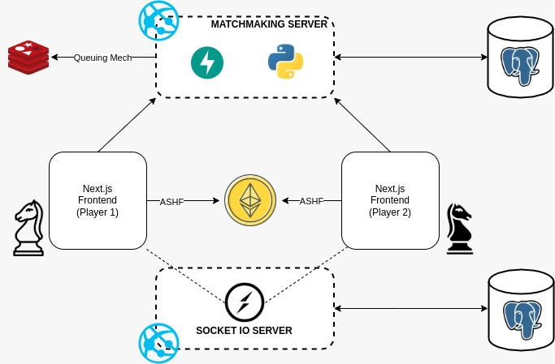

<!-- PROJECT Intro -->
 

  
    <h1>Shatranj</h1>

### The classic game of chess with a modern prize for winning. Play with $ASHF, winner takes it all.
Official submission  to [TRON Grand Hackathon - Season 3](https://trons3.devpost.com/) 

Check out today - https://shatranj.vercel.app/

<!-- ABOUT THE PROJECT -->

## About The Project

 
We know that Chess games are widely popular today. Shatranj increases the incentive and the stake to play this classic ancient game with Web3 tokens we call Asharfi (ancient coins in India) $ASHF. Both players of the game that connect unsing our special matchmaking algorithm agree on a bid amount and the winner of the game takes all the $ASHF (game token) in the prize pool.

## Technology Stack
### Frontend
1. React.js
2. Next.js
3. Chess.js
4. Chakra UI
5. TypeScript

### Backend
1. Python
2. Fast API
3. PostgreSQL
4. Socket.IO
5. AWS EC2

### Web3
1. Ethers
2. Truffle
3. Solidity
4. Metamask
5. Web3 Token
6. Ganache-CLI (For Testing Purposes)
7. Polygon Network
8. ASHF - ERC20 Token Deployed on Polygon Network
9. Open Zeppelin for ERC20 Contract

## Implementation and Deployment
The Frontend of the application is deployed over Vercel and it harnesses the capabilities of the aforementioned Technology Stack.

## Prize Tracks
 - GameFi 
 - Ecosystem

## Ending Notes
If you like this project you can contribute to this and make sure to star it as it helps me to build more new projects.